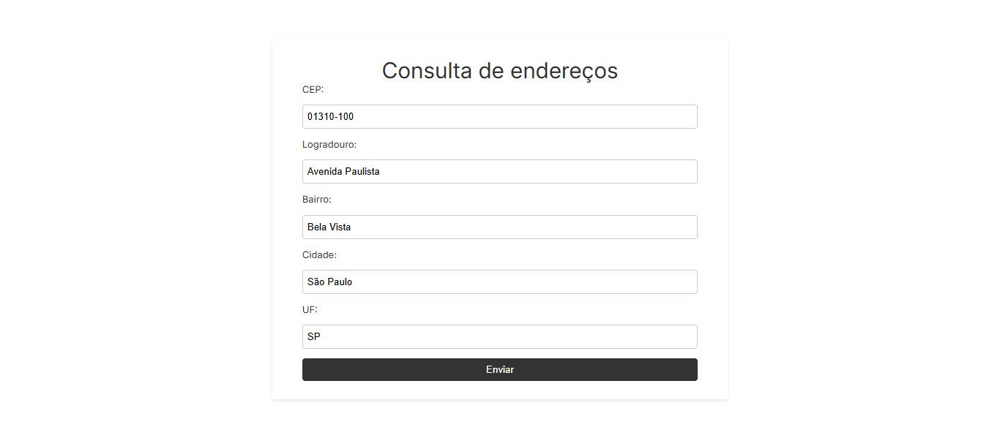
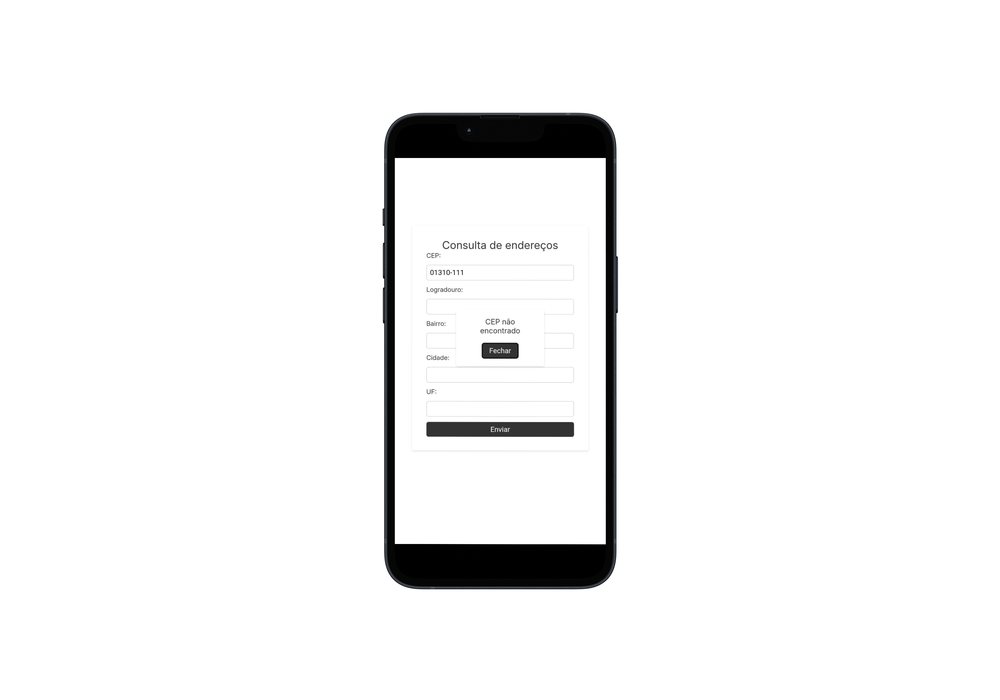

# Form CEP


> Uma aplicação web simples que consulta e preenche automaticamente um formulário de endereço a partir de um CEP informado, utilizando a API pública **ViaCEP**.

---

## Índice

- [Sobre](#-sobre)
- [Preview](#-preview)
- [Funcionalidades](#-funcionalidades)
- [Objetivos de Aprendizagem](#-objetivos-de-aprendizagem)
- [Tecnologias Utilizadas](#️-tecnologias-utilizadas)
- [Como Executar](#-como-executar)
- [Link do Projeto](#-link-do-projeto)
- [Licença](#-licença)

---

## Sobre

Este projeto foi criado para praticar o consumo de APIs REST no front-end, manipulação assíncrona de dados com JavaScript moderno (`async/await`) e a atualização dinâmica de elementos do DOM. O código foi estruturado em módulos para separar responsabilidades, tornando-o mais limpo e organizado.

---

## Preview

### Tela Desktop


### Tela Mobile


---

## Funcionalidades

-   **Consulta em tempo real:** A busca na API é disparada automaticamente quando o usuário digita um CEP de 8 dígitos.
-   **Preenchimento automático:** Os campos de logradouro, bairro, cidade e estado são preenchidos com os dados retornados pela API.
-   **Validação de entrada:** O sistema verifica se o CEP digitado contém 8 números (ignorando outros caracteres).
-   **Tratamento de erros:** Exibe uma mensagem clara para o usuário caso o CEP não seja encontrado ou ocorra um erro na requisição.

---

## Objetivos de Aprendizagem

O desenvolvimento deste projeto permitiu aprimorar as seguintes habilidades:

-   Consumo de APIs externas utilizando `fetch`.
-   Implementação de lógica assíncrona com `async/await` e `Promises`.
-   Manipulação de elementos do DOM para exibir dados e feedback ao usuário.
-   Estruturação do código JavaScript em módulos (`import`/`export`).
-   Uso de CSS moderno, incluindo Flexbox e unidades responsivas como `clamp()`, para criar layouts adaptáveis.

---

## Tecnologias Utilizadas

-   **HTML5** para a estrutura semântica.
-   **CSS3** para estilização e layout responsivo.
-   **JavaScript (ES6+)** para a lógica, interatividade e consumo da API.
-   **API:** [ViaCEP](https://viacep.com.br/)

---

## Como Executar

O projeto é composto apenas por arquivos estáticos (HTML, CSS, JS), então não necessita de um servidor ou passos de build.

1.  Clone este repositório:
    ```bash
    git clone [https://github.com/seu-usuario/seu-repositorio.git](https://github.com/seu-usuario/seu-repositorio.git)
    ```
2.  Navegue até o diretório do projeto:
    ```bash
    cd seu-repositorio
    ```
3.  Abra o arquivo `index.html` em seu navegador de preferência.

---

## Link do Projeto

Você pode acessar a versão online do projeto através deste link:

[https://form-cep-nine.vercel.app/](https://form-cep-nine.vercel.app/)

---

## Licença

Este projeto está sob a licença MIT. Para mais detalhes, consulte o arquivo [LICENSE](LICENSE).
