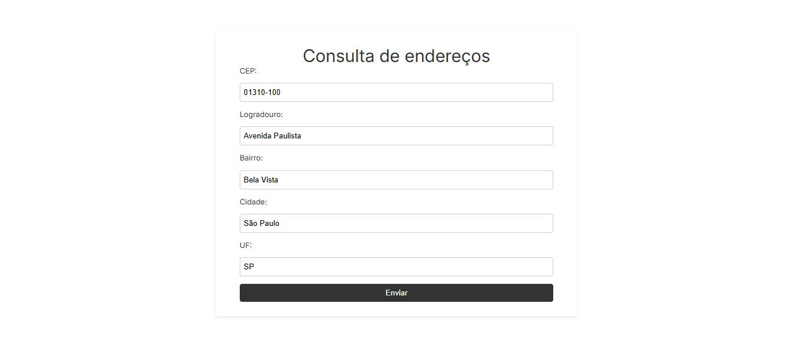
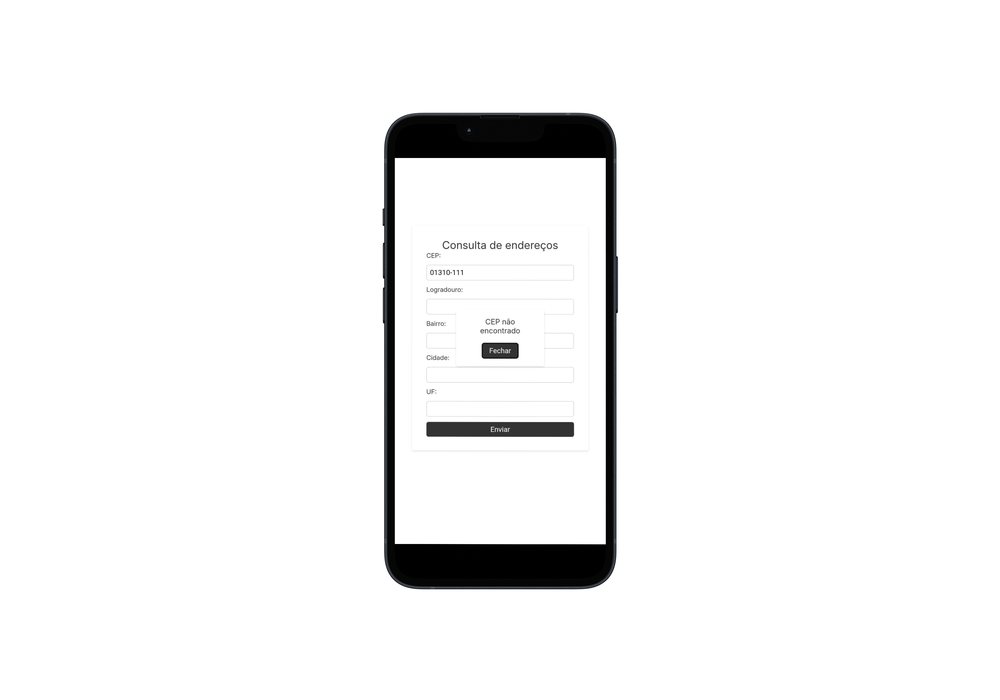

# Form CEP


> Uma aplicação web simples que consulta e preenche automaticamente um formulário de endereço a partir de um CEP informado, utilizando a API pública **ViaCEP**.

---

## Índice

- [Sobre](#-sobre)
- [Preview](#-preview)
- [Funcionalidades](#-funcionalidades)
- [Objetivos de Aprendizagem](#-objetivos-de-aprendizagem)
- [Tecnologias Utilizadas](#️-tecnologias-utilizadas)
- [Como Executar](#-como-executar)
- [Link do Projeto](#-link-do-projeto)
- [Licença](#-licença)

---

## Sobre

Este projeto foi criado para praticar o consumo de APIs REST no front-end, manipulação assíncrona de dados com **TypeScript** e `async/await`, e a atualização dinâmica de elementos do DOM.

O código foi refatorado de JavaScript para TypeScript, adicionando tipagem estática para garantir a segurança dos dados, especialmente no retorno da API. A estrutura foi organizada em módulos TypeScript para separar responsabilidades, tornando o código mais limpo e de fácil manutenção.

---

## Preview

### Tela Desktop



### Tela Mobile



---

## Funcionalidades

- **Consulta em tempo real:** A busca na API é disparada automaticamente quando o usuário digita um CEP de 8 dígitos.
- **Preenchimento automático:** Os campos de logradouro, bairro, cidade e estado são preenchidos com os dados retornados pela API.
- **Validação de entrada:** O sistema verifica se o CEP digitado contém 8 números (ignorando outros caracteres).
- **Tratamento de erros:** Exibe uma mensagem clara para o usuário caso o CEP não seja encontrado ou ocorra um erro na requisição.

---

## Objetivos de Aprendizagem

O desenvolvimento e a refatoração deste projeto permitiram aprimorar as seguintes habilidades:

- Migração de um projeto JavaScript para **TypeScript**.
- Aplicação de **tipagem estática** em variáveis, funções e elementos do DOM.
- Criação de tipos personalizados (`type alias`) para modelar dados (ex: `Address`).
- Uso de **Type Guards** (`isAddress`) para validar de forma segura o retorno da API.
  - Consumo de APIs externas utilizando `fetch`.
  - Implementação de lógica assíncrona com `async/await` e `Promises`.
- Manipulação de elementos do DOM com tipagem (`as HTMLInputElement`, `NodeListOf`).
  - Estruturação do código em módulos TypeScript (`import`/`export`).
  - Uso de CSS moderno, incluindo Flexbox e unidades responsivas como `clamp()`, para criar layouts adaptáveis.

---

## Tecnologias Utilizadas

-   **HTML5** para a estrutura semântica.
-   **CSS3** para estilização e layout responsivo.
-   **TypeScript** para a lógica, interatividade, tipagem e consumo da API.
-   **API:** [ViaCEP](https://viacep.com.br/)

---

---

## Como Executar

Este projeto utiliza TypeScript e precisa ser **compilado** para JavaScript antes de ser executado no navegador.

1.  Clone este repositório:

    ```bash
    git clone https://github.com/Cayuaz/form-cep.git
    ```

2.  Navegue até o diretório do projeto:

    ```bash
    cd form-cep
    ```

3.  Instale as dependências de desenvolvimento (incluindo o TypeScript):

    ```bash
    npm install
    ```

4.  Compile o código TypeScript para JavaScript:

    ```bash
    npx tsc
    ```

5.  Isso criará (ou atualizará) uma pasta `dist` com os arquivos `.js` compilados.

6.  Abra o arquivo `index.html` em seu navegador de preferência.

_Alternativamente, utilize uma extensão como o "Live Server" no VS Code para servir o diretório que contém o `index.html` e os arquivos `.js` compilados._

---

## Link do Projeto

Você pode acessar a versão online do projeto através deste link:

[https://form-cep-nine.vercel.app/](https://form-cep-nine.vercel.app/)

---

## Licença

Este projeto está sob a licença MIT. Para mais detalhes, consulte o arquivo [LICENSE](LICENSE).
